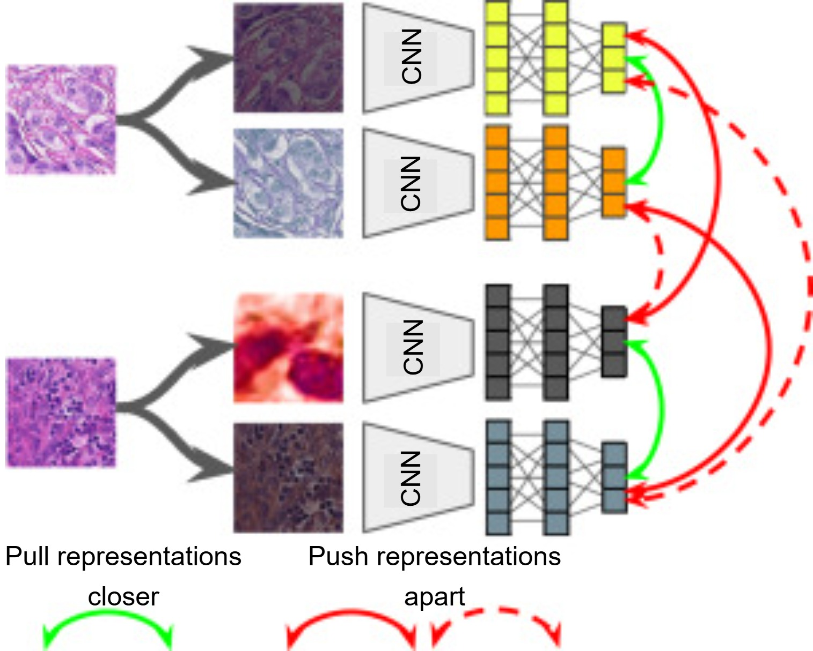
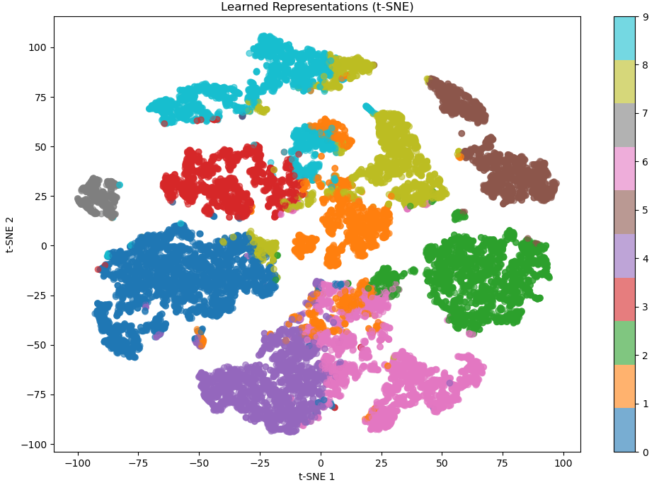

# 🧠 ContrastiveLearn — Unified Self-Supervised Representation Learning Framework

> A modular, production-ready framework for contrastive and self-supervised pretraining — supporting 8 state-of-the-art methods, flexible backbone encoders, and built-in downstream tasks including classification, clustering, and visualisation.

[](https://www.python.org/)
[](https://pytorch.org/)
[](LICENSE)
[](#implemented-methods)
[](#downstream-tasks)

---

## Table of Contents

- [What is Contrastive Learning?](#what-is-contrastive-learning)
- [Why Contrastive Learning?](#why-contrastive-learning)
- [Implemented Methods](#implemented-methods)
- [Supported Backbones](#supported-backbones)
- [Downstream Tasks](#downstream-tasks)
- [Project Structure](#project-structure)
- [Environment Setup](#environment-setup)
- [Configuration](#configuration)
- [Usage](#usage)
  - [Pretraining](#pretraining)
  - [Evaluation](#evaluation)
  - [Inference](#inference)
- [Adding a New Model](#adding-a-new-model)
- [Acknowledgements](#acknowledgements)

---

## What is Contrastive Learning?

**Contrastive learning** is a family of self-supervised representation learning techniques that train deep neural networks to produce meaningful feature embeddings **without any human-provided labels**. The core idea is elegantly simple: teach the model that different views of the same image should be represented similarly, while different images should be represented differently.

<p align="center">
  
  <br/>
  <em>Figure 1: Contrastive learning pulls together representations of augmented views of the same image (positive pairs) while pushing apart representations of different images (negative pairs).</em>
</p>

### How it works

Given an image, two random augmented views — called a **positive pair** — are generated using transformations such as random cropping, colour jitter, Gaussian blur, and flipping. The model processes both views and maps them to an embedding space. The training objective encourages:

- **Positive pairs** (same image, different augmentations) → similar representations
- **Negative pairs** (different images) → dissimilar representations

More recent methods such as BYOL and DINO eliminate the need for explicit negative pairs entirely, instead using a **teacher–student** or **momentum-updated** architecture that prevents representation collapse.
 

### The embedding space

After training, the encoder has learned a rich representation space where:
- Images sharing similar semantic content cluster together
- Distinct classes are naturally separated
- The geometry reflects visual similarity — without a single labelled example

<p align="center">
  
  <br/>
  <em>Figure 2: t-SNE visualisation of embeddings learned by contrastive pretraining. Semantically similar images cluster together despite no labels being used during training.</em>
</p>

---

## Why Contrastive Learning?

| Challenge | Contrastive Learning Solution |
|---|---|
| **Labelling is expensive** | Learns from unlabelled data — labels only needed for fine-tuning |
| **Limited labelled data** | Pretrain on large unlabelled corpora; fine-tune with few labels |
| **Domain shift** | Domain-specific pretraining captures task-relevant features |
| **Transfer learning** | Pretrained encoder transfers across datasets and tasks |
| **Clustering & retrieval** | Embedding space enables unsupervised organisation of data |

### Key advantages over supervised learning

- **Label efficiency** — a linear probe on top of contrastive features often matches or exceeds full supervised training with far fewer labels
- **Generality** — a single pretrained encoder can be fine-tuned for classification, detection, segmentation, and retrieval
- **Data scalability** — performance scales with unlabelled data, which is abundant
- **Robustness** — self-supervised features are often more robust to distribution shifts

### Applications in medical and scientific imaging

Contrastive learning has proven especially powerful in domains where annotation is scarce and expensive:

- 🔬 **Histopathology** — pretrain on millions of tissue patches; fine-tune with dozens of annotated slides
- 🧬 **Cell imaging** — cluster morphologically similar cells without manual classification
- 🩻 **Radiology** — learn robust features across scanner types and institutions
- 🌍 **Remote sensing** — represent satellite tiles for land-use classification
- 🎨 **General vision** — strong baseline for any image understanding task

---

## Implemented Methods

| # | Method | Year | Type | Key Idea |
|---|---|---|---|---|
| 1 | **SimCLR** | 2020 | Contrastive | NT-Xent loss over large batch negative pairs |
| 2 | **BYOL** | 2020 | Self-distillation | EMA teacher eliminates negatives entirely |
| 3 | **DINO** | 2021 | Self-distillation | Knowledge distillation with multi-crop and centering |
| 4 | **MoCo v3** | 2021 | Momentum contrastive | Momentum encoder + ViT-compatible InfoNCE |
| 5 | **Barlow Twins** | 2021 | Redundancy reduction | Cross-correlation matrix towards identity |
| 6 | **VICReg** | 2022 | Variance-invariance | Variance + invariance + covariance regularisation |
| 7 | **iBOT** | 2022 | Masked prediction | DINO + online masked patch tokenizer |
| 8 | **SwAV** | 2020 | Clustering | Online prototypes with Sinkhorn-Knopp assignment |

All methods share a **unified training interface** — switching between them requires only changing the `--config` argument.

---

## Supported Backbones

| Backbone | Output Dim | Notes |
|---|---|---|
| `resnet18` | 512 | Lightweight — fast training |
| `resnet50` | 2048 | Standard workhorse |
| `resnet101` | 2048 | Higher capacity ResNet |
| `convnext_tiny` | 768 | Modern CNN, strong baseline |
| `convnext_base` | 1024 | Higher capacity ConvNeXt |
| `efficientnet_b0` | 1280 | Efficient mobile-scale |
| `efficientnet_b3` | 1536 | Balanced efficiency/accuracy |
| `vit_s` | 384 | ViT-Small — preferred for DINO/iBOT |
| `vit_b` | 768 | ViT-Base — strong general backbone |
| `vit_l` | 1024 | ViT-Large — highest capacity |

> ViT backbones require `timm`: `pip install timm`

---

## Downstream Tasks

After pretraining, the frozen or fine-tuned encoder can be used for three downstream workflows:

### 1. Classification (`test.py --task linear_probe`)
- Attaches a linear head or small MLP on top of the frozen encoder
- Supports **full fine-tuning** (`freeze_backbone: false`) or **linear probe** (`freeze_backbone: true`)
- Evaluates with accuracy and classification report

### 2. Clustering (`infer.py --task clustering`)
- Extracts embeddings for all images
- Supports **k-means**, **agglomerative**, and **DBSCAN** clustering
- Auto-k via elbow method (`auto_k: true`)
- **Partial sampling** — cluster a representative subset (`partial_ratio: 0.5`)
- Saves per-image cluster assignments to CSV

### 3. Visualisation (`infer.py --task visualize`)
- Reduces embeddings with **t-SNE**, **UMAP**, or **PCA**
- Generates colour-coded scatter plots
- Saves sample image grids per cluster for qualitative inspection

---

## Project Structure

```
cl_framework/
│
├── configs/
│   ├── base.yaml               ← Shared defaults (seed, device, augmentation, training, backbone)
│   ├── simclr.yaml             ← SimCLR-specific overrides
│   ├── byol.yaml
│   ├── dino.yaml               ← Multi-crop settings
│   ├── mocov3.yaml
│   ├── barlow_twins.yaml
│   ├── vicreg.yaml
│   ├── ibot.yaml
│   ├── swav.yaml
│   └── downstream.yaml         ← Classification / clustering / visualisation settings
│
├── modules/
│   ├── __init__.py             ← MODEL_REGISTRY + get_model(cfg)
│   ├── simclr/model.py
│   ├── byol/model.py
│   ├── dino/model.py
│   ├── mocov3/model.py
│   ├── barlow_twins/model.py
│   ├── vicreg/model.py
│   ├── ibot/model.py
│   └── swav/model.py
│
├── utils/
│   ├── config.py               ← YAML loader with _base_ inheritance + CLI --options override
│   ├── backbones.py            ← Backbone encoder registry
│   ├── dataset.py              ← ContrastiveDataset, EvalDataset, augmentation factory
│   ├── losses.py               ← All loss functions (NT-Xent, BYOL, DINO, BarlowTwins, VICReg, …)
│   ├── optimizer.py            ← Optimizer + LR scheduler factory (warmup + cosine/step/plateau)
│   └── logger.py               ← Console logger, CSVLogger, CheckpointManager (top-k)
│
├── downstream/
│   └── tasks.py                ← Linear probe, clustering, t-SNE/UMAP visualisation
│
├── logs/                       ← Auto-created per run: logs/<timestamp>_<model>/
│   └── 20240601_120000_simclr/
│       ├── checkpoints/
│       │   ├── best.pth
│       │   └── epoch_0100_metric_0.4321.pth
│       ├── metrics.csv
│       └── simclr.yaml         ← Config snapshot for reproducibility
│
├── train.py                    ← Pretraining entry point
├── test.py                     ← Evaluation on labelled test set
├── infer.py                    ← Inference / embedding / clustering on unlabelled images
├── environment.yml
└── requirements.txt
```

---

## Environment Setup

#### Using conda (recommended)

```bash
conda env create -f environment.yml
conda activate cl_framework
```

#### Using pip

```bash
pip install -r requirements.txt
```

---

## Configuration

All settings are controlled via YAML files in `configs/`. Each model config **inherits from `base.yaml`** and only overrides what it needs.

### Key `base.yaml` fields

```yaml
General:
  seed: 42
  device: 0                    # GPU index; -1 = CPU
  mixed_precision: true

Dataset:
  train_dir: /path/to/images   # recursively scanned for all images
  test_dir:  /path/to/test
  image_size: 256

Backbone:
  name: resnet50               # see Supported Backbones table
  pretrained: false

Training:
  epochs: 200
  batch_size: 256
  optimizer: adamw             # adam | adamw | sgd | lars
  learning_rate: 3.0e-4
  scheduler: cosine            # cosine | step | plateau | none
  warmup_epochs: 10

Logs:
  log_root_dir: logs/
  save_every_n_epochs: 10
  keep_best_k: 3
```

Any field can be **overridden at the command line** without editing YAML files:

```bash
python train.py --config configs/simclr.yaml \
    --options General.device=2 Training.epochs=100 Backbone.name=resnet18
```

---

## Usage

### Pretraining

```bash
# SimCLR with ResNet-50
python train.py --config configs/simclr.yaml \
    --options Dataset.train_dir=/data/images General.device=0

# BYOL with LARS optimizer
python train.py --config configs/byol.yaml \
    --options Dataset.train_dir=/data/images Training.batch_size=128

# DINO with ViT-Small backbone
python train.py --config configs/dino.yaml \
    --options Backbone.name=vit_s Training.batch_size=32 General.device=1

# Barlow Twins
python train.py --config configs/barlow_twins.yaml \
    --options Dataset.train_dir=/data/images Training.epochs=300

# VICReg
python train.py --config configs/vicreg.yaml \
    --options Dataset.train_dir=/data/images

# MoCo v3
python train.py --config configs/mocov3.yaml

# iBOT (DINO + masked prediction)
python train.py --config configs/ibot.yaml \
    --options Backbone.name=vit_s

# SwAV (online clustering)
python train.py --config configs/swav.yaml
```

Training outputs are saved automatically to:
```
logs/<timestamp>_<model_name>/
├── checkpoints/best.pth
├── metrics.csv
└── <config>.yaml
```

---

### Evaluation

Evaluate a pretrained encoder on a **labelled test set**:

```bash
# Linear probe (frozen backbone)
python test.py --config configs/simclr.yaml \
    --checkpoint logs/20240601_simclr/checkpoints/best.pth \
    --task linear_probe \
    --options Dataset.test_dir=/data/test Downstream.num_classes=9

# Full fine-tuning
python test.py --config configs/byol.yaml \
    --checkpoint logs/.../checkpoints/best.pth \
    --task linear_probe \
    --options Downstream.freeze_backbone=false

# Clustering on test set
python test.py --config configs/simclr.yaml \
    --checkpoint logs/.../checkpoints/best.pth \
    --task clustering \
    --options Downstream.Clustering.n_clusters=9

# Visualise embeddings
python test.py --config configs/simclr.yaml \
    --checkpoint logs/.../checkpoints/best.pth \
    --task visualize \
    --options Downstream.Visualization.method=tsne
```

---

### Inference

Run on **unlabelled images** — embed, cluster, and visualise:

```bash
# Extract embeddings only
python infer.py --config configs/simclr.yaml \
    --checkpoint logs/.../checkpoints/best.pth \
    --task embedding \
    --options Dataset.infer_dir=/data/new_images

# Cluster only
python infer.py --config configs/simclr.yaml \
    --checkpoint logs/.../checkpoints/best.pth \
    --task clustering \
    --options Dataset.infer_dir=/data/new_images \
              Downstream.Clustering.n_clusters=9 \
              Downstream.Clustering.auto_k=true

# Cluster + visualise (most common workflow)
python infer.py --config configs/simclr.yaml \
    --checkpoint logs/.../checkpoints/best.pth \
    --task cluster_and_visualize \
    --options Dataset.infer_dir=/data/new_images \
              Downstream.Clustering.n_clusters=9 \
              Downstream.Visualization.method=umap
```

**Inference outputs:**

```
outputs/visualizations/
├── embeddings.npy              ← raw feature vectors (N × D)
├── image_paths.csv             ← path for each embedding row
├── cluster_assignments.csv     ← image_path, cluster_id per row
├── umap_scatter.png            ← 2D embedding scatter plot
└── cluster_<k>_samples.png    ← sample image grid per cluster
```

---

## Adding a New Model

Four steps — `train.py`, `test.py`, and `infer.py` require **zero modifications**.

**Step 1** — Create the model file:

```
modules/my_method/model.py
modules/my_method/__init__.py
```

Implement the standard interface:

```python
class MyMethod(nn.Module):
    def __init__(self, backbone, cfg):
        super().__init__()
        ...

    def forward(self, views, **kwargs) -> dict:
        # Must return {"loss": tensor}
        ...

    @torch.no_grad()
    def get_embedding(self, x: torch.Tensor) -> torch.Tensor:
        # Returns feature vector for downstream tasks
        return self.encoder(x)
```

**Step 2** — Register in `modules/__init__.py`:

```python
from modules.my_method.model import MyMethod
MODEL_REGISTRY["my_method"] = MyMethod
```

**Step 3** — Create a YAML config:

```yaml
# configs/my_method.yaml
_base_: base.yaml

General:
  model_name: my_method

MyMethod:
  projection_dim: 256
  temperature: 0.1
```

**Step 4** — Train:

```bash
python train.py --config configs/my_method.yaml
```

---

## Acknowledgements

This framework is inspired by and builds upon:

- [SimCLR](https://github.com/google-research/simclr) — Chen et al., 2020
- [BYOL](https://github.com/deepmind/deepmind-research/tree/master/byol) — Grill et al., 2020
- [DINO](https://github.com/facebookresearch/dino) — Caron et al., 2021
- [MoCo v3](https://github.com/facebookresearch/moco-v3) — Chen et al., 2021
- [Barlow Twins](https://github.com/facebookresearch/barlowtwins) — Zbontar et al., 2021
- [VICReg](https://github.com/facebookresearch/vicreg) — Bardes et al., 2022
- [iBOT](https://github.com/bytedance/ibot) — Zhou et al., 2022
- [SwAV](https://github.com/facebookresearch/swav) — Caron et al., 2020

---

<p align="center">
  Built for scalable, label-efficient visual representation learning.
</p>
